# AREP Taller de Disponibilidad y Autoescalamiento

El objetivo de este laboratorio es implementar un aplicativo web que consuma un gran porcentaje de procesamiento para posteriormente crear una instancia en AWS que tenga auto escalamiento, de esta manera podrá soportar un mayor número de peticiones.

La aplicación web que se realizó, consiste en que dado un número n, se realizará la sumatoria de 1 a n de las combinatorias (i, n).
Para que la aplicación consuma mucho más procesamiento, no se memorizó ningún resultado previamente calculado, esto hace que tenga que recalcular el mismo dato cada vez que sea solicitado.

## Pasos para crear una instancia en AWS que tenga auto escalamiento.

### 1. Crear imagen AMI a partir de una máquina virtual con la imagen de Docker.

Lo primero que tenemos que hacer es configurar nuestro archivo crontab para que al crear una nueva instancia, se inicie el servicio de docker y corra la imagen de Docker Hub.
Para ello, escribimos el siguiente comando y agregamos las lineas mostradas a continuación:

     crontab -e
     
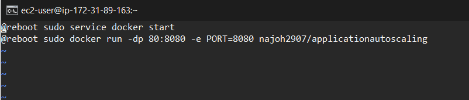

Reiniciamos la instancia y verificamos que funciona correctamente.

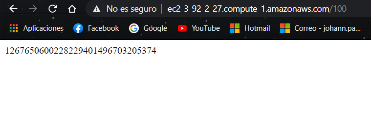

Creamos y configuramos una imagen con la instancia previamente configurada.

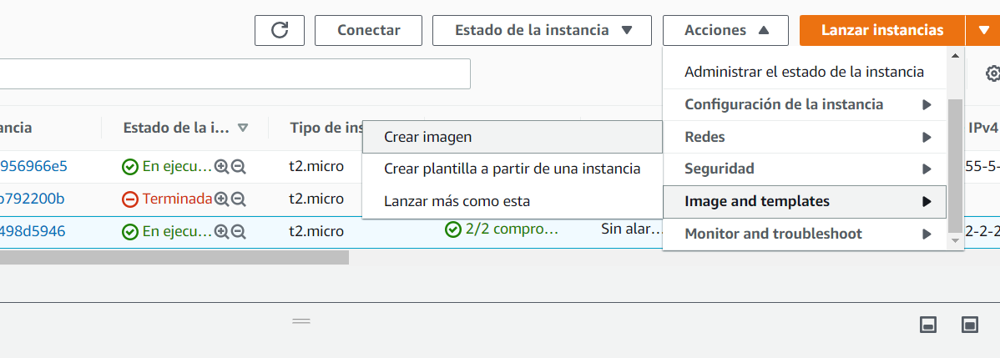

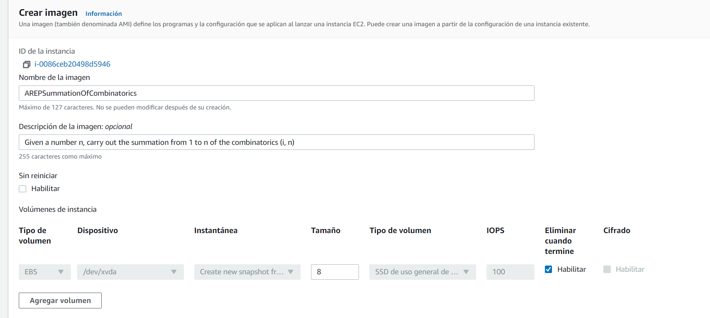

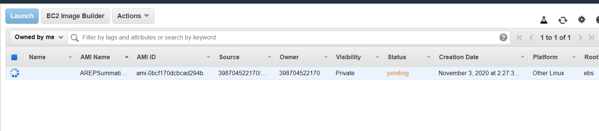

### 2. Configurar plantilla a partir de una instancia de una imagen AMI.

Creamos una nueva instancia a partir de la imagen previamente creada.

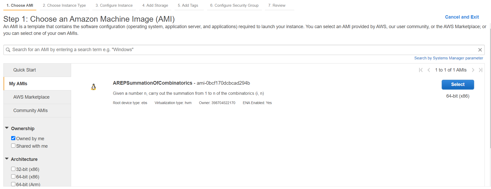

Posteriormente creamos y configuramos la plantilla con la misma instancia.

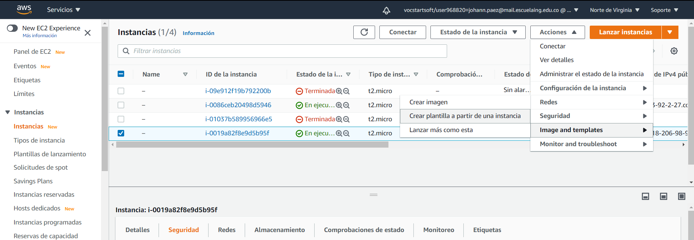

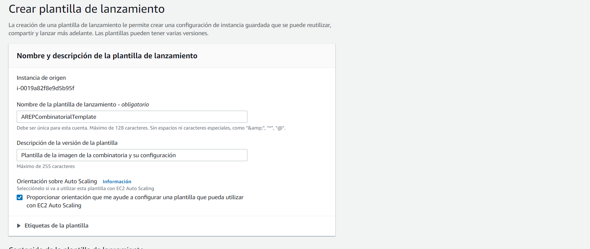

Agregamos el grupo de seguridad que contiene las reglas de entrada, en este caso el puerto en el que estará expuesto nuestro servicio.

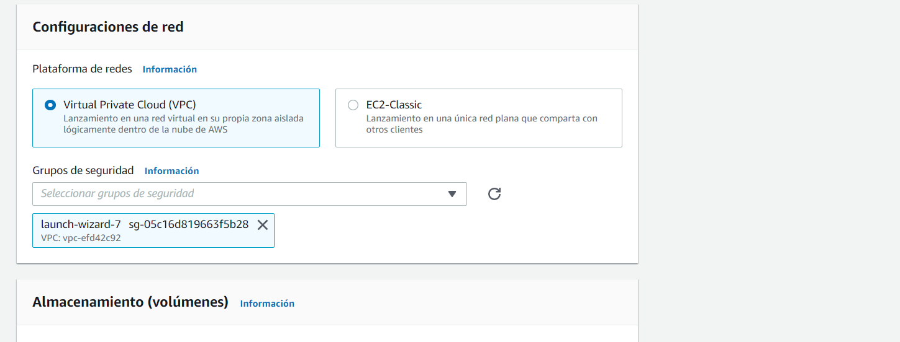

Verificamos que se haya creado correctamente.

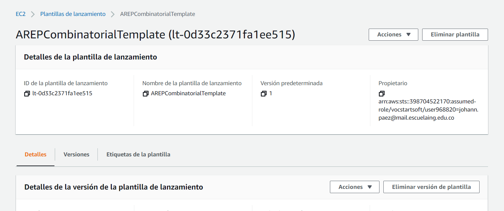

### 3. Configurar grupo de auto escalamiento.

Creamos y configuramos el grupo de auto escalamiento en el menú "Auto Scaling".

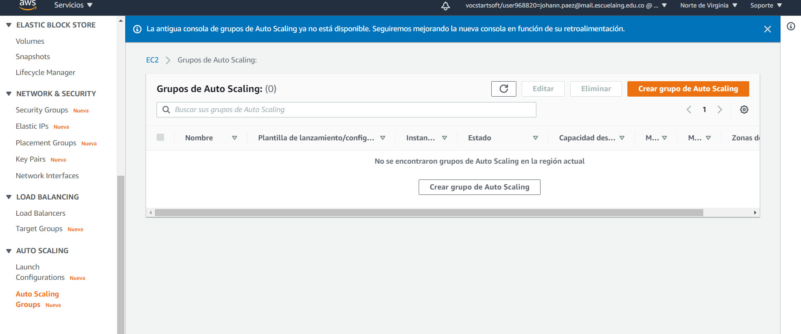

Elegimos y configuramos la plantilla previamente creada.

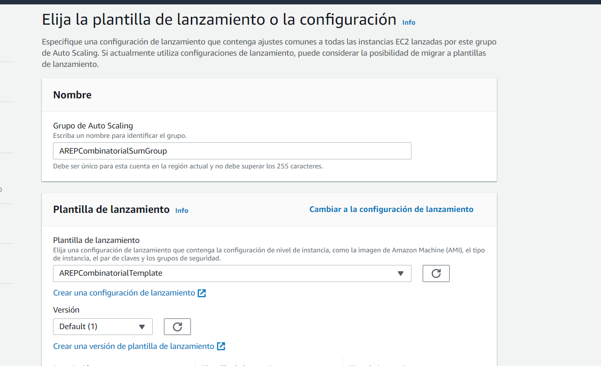

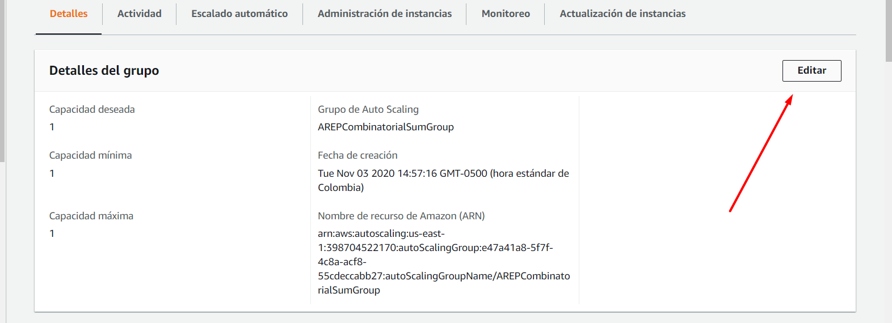

En esta sección, escogemos el número de instancias que se quieren lanzar inicialmente y el número máximo que se pueden tener en este grupo.

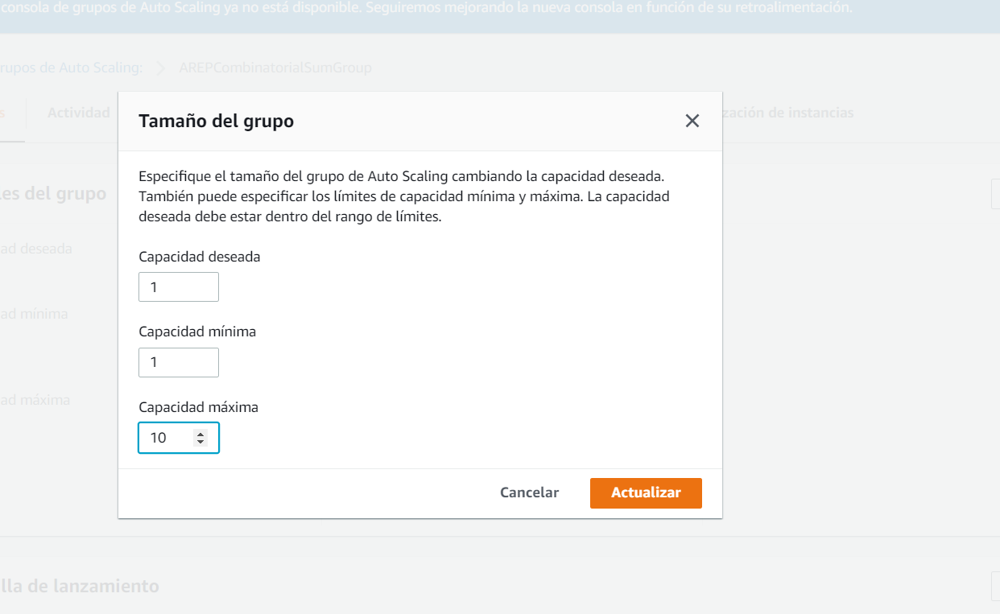

Finalmente añadimos una política de escalado que servirá para saber cuando lanzar una nueva instancia.

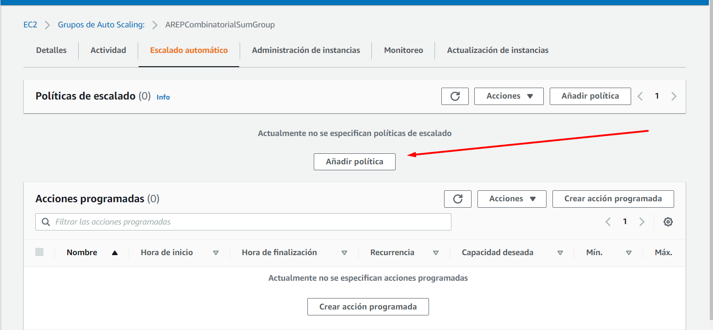

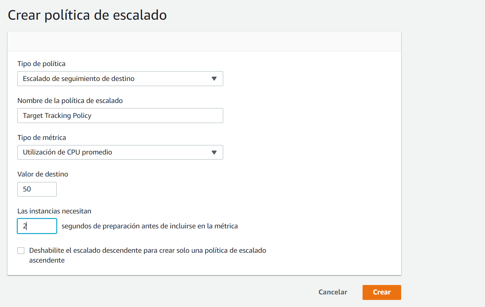

## Video Demostrativo

El video demostrativo de que la configuración realizada escala automáticamente y crea nuevas instancias para soportar nuevas peticiones.

- https://www.youtube.com/watch?v=_M2e8o5Ycq8&ab_channel=SebastianP%C3%A1ez.

## Construido con

- [Maven](https://maven.apache.org/) Administrador de dependencias.

- [Docker](https://www.docker.com/) Administrador de contenedores.

- [Spark](http://sparkjava.com/) Framework para desarrollar aplicaciones web.

- [GitHub](https://github.com/) Sistema de control de versiones Git.

## Autor
**Johann Sebastian Páez Campos** - Trabajo Programación AREP-Taller de Disponibilidad y Autoescalamiento **03/11/2020**

## Licencia
Este programa es de uso libre, puede ser usado por cualquier persona.

Los terminos de la licencia se pueden encontrar en el siguiente archivo [License](LICENSE)
